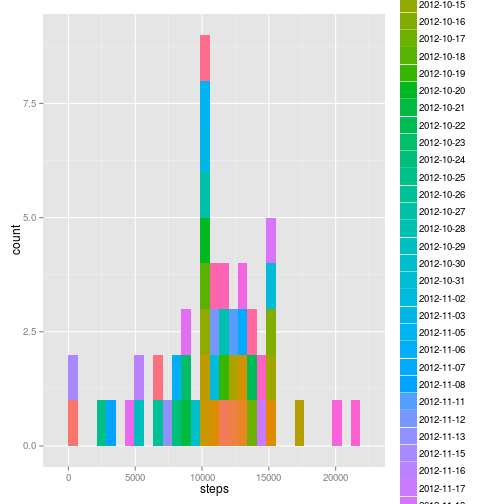
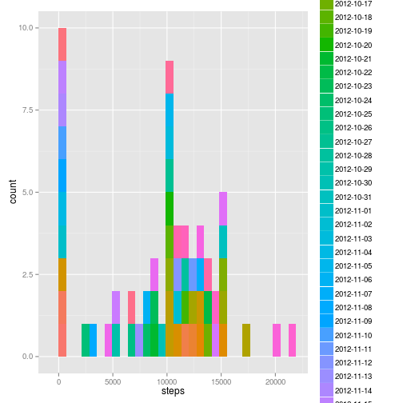
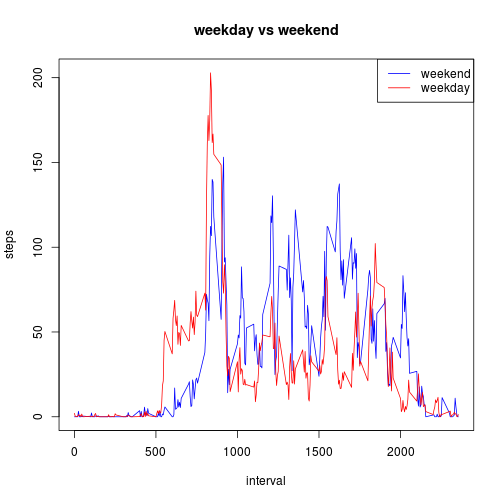

#Reproducible Research: Peer Assessment 1

##Loading and preprocessing the data

1. Load the data


```r
file <- read.csv("/home/arun/data/assg/RepData_PeerAssessment1/activity.csv", sep = ",", header = TRUE)
```

2. Process/transform the data (if necessary) into a format suitable for your analysis


```r
file1 <- aggregate(. ~ date, data=file, FUN=sum, na.rm = TRUE)
```

##Mean of total number of steps taken per day

1.histogram of the total number of steps taken each day


```r
library(ggplot2)

qplot(steps, data = file1, fill = date)
```

```
## stat_bin: binwidth defaulted to range/30. Use 'binwidth = x' to adjust this.
```

 

2.To calculate mean and median  total number of steps taken per day


```r
 file_mean <- aggregate(. ~ date, data=file, FUN=mean, na.rm = TRUE)

file_mean
```

```
##          date      steps interval
## 1  2012-10-02  0.4375000   1177.5
## 2  2012-10-03 39.4166667   1177.5
## 3  2012-10-04 42.0694444   1177.5
## 4  2012-10-05 46.1597222   1177.5
## 5  2012-10-06 53.5416667   1177.5
## 6  2012-10-07 38.2465278   1177.5
## 7  2012-10-09 44.4826389   1177.5
## 8  2012-10-10 34.3750000   1177.5
## 9  2012-10-11 35.7777778   1177.5
## 10 2012-10-12 60.3541667   1177.5
## 11 2012-10-13 43.1458333   1177.5
## 12 2012-10-14 52.4236111   1177.5
## 13 2012-10-15 35.2048611   1177.5
## 14 2012-10-16 52.3750000   1177.5
## 15 2012-10-17 46.7083333   1177.5
## 16 2012-10-18 34.9166667   1177.5
## 17 2012-10-19 41.0729167   1177.5
## 18 2012-10-20 36.0937500   1177.5
## 19 2012-10-21 30.6284722   1177.5
## 20 2012-10-22 46.7361111   1177.5
## 21 2012-10-23 30.9652778   1177.5
## 22 2012-10-24 29.0104167   1177.5
## 23 2012-10-25  8.6527778   1177.5
## 24 2012-10-26 23.5347222   1177.5
## 25 2012-10-27 35.1354167   1177.5
## 26 2012-10-28 39.7847222   1177.5
## 27 2012-10-29 17.4236111   1177.5
## 28 2012-10-30 34.0937500   1177.5
## 29 2012-10-31 53.5208333   1177.5
## 30 2012-11-02 36.8055556   1177.5
## 31 2012-11-03 36.7048611   1177.5
## 32 2012-11-05 36.2465278   1177.5
## 33 2012-11-06 28.9375000   1177.5
## 34 2012-11-07 44.7326389   1177.5
## 35 2012-11-08 11.1770833   1177.5
## 36 2012-11-11 43.7777778   1177.5
## 37 2012-11-12 37.3784722   1177.5
## 38 2012-11-13 25.4722222   1177.5
## 39 2012-11-15  0.1423611   1177.5
## 40 2012-11-16 18.8923611   1177.5
## 41 2012-11-17 49.7881944   1177.5
## 42 2012-11-18 52.4652778   1177.5
## 43 2012-11-19 30.6979167   1177.5
## 44 2012-11-20 15.5277778   1177.5
## 45 2012-11-21 44.3993056   1177.5
## 46 2012-11-22 70.9270833   1177.5
## 47 2012-11-23 73.5902778   1177.5
## 48 2012-11-24 50.2708333   1177.5
## 49 2012-11-25 41.0902778   1177.5
## 50 2012-11-26 38.7569444   1177.5
## 51 2012-11-27 47.3819444   1177.5
## 52 2012-11-28 35.3576389   1177.5
## 53 2012-11-29 24.4687500   1177.5
```

```r
file_median <- aggregate(. ~ date, data=file, FUN=median, na.rm = TRUE)

file_median
```

```
##          date steps interval
## 1  2012-10-02     0   1177.5
## 2  2012-10-03     0   1177.5
## 3  2012-10-04     0   1177.5
## 4  2012-10-05     0   1177.5
## 5  2012-10-06     0   1177.5
## 6  2012-10-07     0   1177.5
## 7  2012-10-09     0   1177.5
## 8  2012-10-10     0   1177.5
## 9  2012-10-11     0   1177.5
## 10 2012-10-12     0   1177.5
## 11 2012-10-13     0   1177.5
## 12 2012-10-14     0   1177.5
## 13 2012-10-15     0   1177.5
## 14 2012-10-16     0   1177.5
## 15 2012-10-17     0   1177.5
## 16 2012-10-18     0   1177.5
## 17 2012-10-19     0   1177.5
## 18 2012-10-20     0   1177.5
## 19 2012-10-21     0   1177.5
## 20 2012-10-22     0   1177.5
## 21 2012-10-23     0   1177.5
## 22 2012-10-24     0   1177.5
## 23 2012-10-25     0   1177.5
## 24 2012-10-26     0   1177.5
## 25 2012-10-27     0   1177.5
## 26 2012-10-28     0   1177.5
## 27 2012-10-29     0   1177.5
## 28 2012-10-30     0   1177.5
## 29 2012-10-31     0   1177.5
## 30 2012-11-02     0   1177.5
## 31 2012-11-03     0   1177.5
## 32 2012-11-05     0   1177.5
## 33 2012-11-06     0   1177.5
## 34 2012-11-07     0   1177.5
## 35 2012-11-08     0   1177.5
## 36 2012-11-11     0   1177.5
## 37 2012-11-12     0   1177.5
## 38 2012-11-13     0   1177.5
## 39 2012-11-15     0   1177.5
## 40 2012-11-16     0   1177.5
## 41 2012-11-17     0   1177.5
## 42 2012-11-18     0   1177.5
## 43 2012-11-19     0   1177.5
## 44 2012-11-20     0   1177.5
## 45 2012-11-21     0   1177.5
## 46 2012-11-22     0   1177.5
## 47 2012-11-23     0   1177.5
## 48 2012-11-24     0   1177.5
## 49 2012-11-25     0   1177.5
## 50 2012-11-26     0   1177.5
## 51 2012-11-27     0   1177.5
## 52 2012-11-28     0   1177.5
## 53 2012-11-29     0   1177.5
```

##Average daily activity pattern

1.  Time series plot (i.e. type = "l") of the 5-minute interval (x-axis) and the average number of steps taken, averaged across all days (y-axis)


```r
compl_cases <- subset(file, complete.cases(file) == TRUE)

file_split <- split(compl_cases, compl_cases$interval, drop = TRUE)

interval_Avg1 <- sapply(file_split, function(x){ mean(x$steps)})

plot(interval_Avg1, type="l",  
     main="5 Minute Interval Time Series", 
     ylab="Average Steps", 
     xlab="Interval" )
```

 

2. 5-minute interval, on average across all the days in the dataset, contains the maximum number of steps


```r
max <- max(interval_Avg1)

max_pos <- which(interval_Avg1 == max)

max_pos
```

```
## 835 
## 104
```

##Imputing missing values

1. Calculation of the total number of missing values in the dataset (i.e. the total number of rows with NAs)


```r
#Create subsets with NA`s and without NA`s

compl_cases <- subset(file, complete.cases(file) == TRUE)

compl_cases1 <- subset(file, complete.cases(file) == FALSE)
```

2. strategy for filling in all of the missing values in the dataset.


```r
#Replace all NA values by Zero
#This will replace NA`s by '0':

compl_cases1[is.na(compl_cases1)] <- 0
```

3.  new dataset that is equal to the original dataset but with the missing data filled in.


```r
new_dataset <- merge(compl_cases, compl_cases1, all = TRUE)
```

4. a)  histogram of the total number of steps taken each day


```r
new_dataset1 <- aggregate(. ~ date, data = new_dataset, FUN=sum, na.rm = TRUE)

qplot(steps, data = new_dataset1, fill = date)
```

```
## stat_bin: binwidth defaulted to range/30. Use 'binwidth = x' to adjust this.
```

 

b) mean and median total number of steps taken per day.


```r
new_mean <- aggregate(. ~ date, data=new_dataset1, FUN=mean, na.rm = TRUE)

new_mean
```

```
##          date steps interval
## 1  2012-10-01     0   339120
## 2  2012-10-02   126   339120
## 3  2012-10-03 11352   339120
## 4  2012-10-04 12116   339120
## 5  2012-10-05 13294   339120
## 6  2012-10-06 15420   339120
## 7  2012-10-07 11015   339120
## 8  2012-10-08     0   339120
## 9  2012-10-09 12811   339120
## 10 2012-10-10  9900   339120
## 11 2012-10-11 10304   339120
## 12 2012-10-12 17382   339120
## 13 2012-10-13 12426   339120
## 14 2012-10-14 15098   339120
## 15 2012-10-15 10139   339120
## 16 2012-10-16 15084   339120
## 17 2012-10-17 13452   339120
## 18 2012-10-18 10056   339120
## 19 2012-10-19 11829   339120
## 20 2012-10-20 10395   339120
## 21 2012-10-21  8821   339120
## 22 2012-10-22 13460   339120
## 23 2012-10-23  8918   339120
## 24 2012-10-24  8355   339120
## 25 2012-10-25  2492   339120
## 26 2012-10-26  6778   339120
## 27 2012-10-27 10119   339120
## 28 2012-10-28 11458   339120
## 29 2012-10-29  5018   339120
## 30 2012-10-30  9819   339120
## 31 2012-10-31 15414   339120
## 32 2012-11-01     0   339120
## 33 2012-11-02 10600   339120
## 34 2012-11-03 10571   339120
## 35 2012-11-04     0   339120
## 36 2012-11-05 10439   339120
## 37 2012-11-06  8334   339120
## 38 2012-11-07 12883   339120
## 39 2012-11-08  3219   339120
## 40 2012-11-09     0   339120
## 41 2012-11-10     0   339120
## 42 2012-11-11 12608   339120
## 43 2012-11-12 10765   339120
## 44 2012-11-13  7336   339120
## 45 2012-11-14     0   339120
## 46 2012-11-15    41   339120
## 47 2012-11-16  5441   339120
## 48 2012-11-17 14339   339120
## 49 2012-11-18 15110   339120
## 50 2012-11-19  8841   339120
## 51 2012-11-20  4472   339120
## 52 2012-11-21 12787   339120
## 53 2012-11-22 20427   339120
## 54 2012-11-23 21194   339120
## 55 2012-11-24 14478   339120
## 56 2012-11-25 11834   339120
## 57 2012-11-26 11162   339120
## 58 2012-11-27 13646   339120
## 59 2012-11-28 10183   339120
## 60 2012-11-29  7047   339120
## 61 2012-11-30     0   339120
```

```r
new_median <- aggregate(. ~ date, data=new_dataset1, FUN=median, na.rm = TRUE)

new_median
```

```
##          date steps interval
## 1  2012-10-01     0   339120
## 2  2012-10-02   126   339120
## 3  2012-10-03 11352   339120
## 4  2012-10-04 12116   339120
## 5  2012-10-05 13294   339120
## 6  2012-10-06 15420   339120
## 7  2012-10-07 11015   339120
## 8  2012-10-08     0   339120
## 9  2012-10-09 12811   339120
## 10 2012-10-10  9900   339120
## 11 2012-10-11 10304   339120
## 12 2012-10-12 17382   339120
## 13 2012-10-13 12426   339120
## 14 2012-10-14 15098   339120
## 15 2012-10-15 10139   339120
## 16 2012-10-16 15084   339120
## 17 2012-10-17 13452   339120
## 18 2012-10-18 10056   339120
## 19 2012-10-19 11829   339120
## 20 2012-10-20 10395   339120
## 21 2012-10-21  8821   339120
## 22 2012-10-22 13460   339120
## 23 2012-10-23  8918   339120
## 24 2012-10-24  8355   339120
## 25 2012-10-25  2492   339120
## 26 2012-10-26  6778   339120
## 27 2012-10-27 10119   339120
## 28 2012-10-28 11458   339120
## 29 2012-10-29  5018   339120
## 30 2012-10-30  9819   339120
## 31 2012-10-31 15414   339120
## 32 2012-11-01     0   339120
## 33 2012-11-02 10600   339120
## 34 2012-11-03 10571   339120
## 35 2012-11-04     0   339120
## 36 2012-11-05 10439   339120
## 37 2012-11-06  8334   339120
## 38 2012-11-07 12883   339120
## 39 2012-11-08  3219   339120
## 40 2012-11-09     0   339120
## 41 2012-11-10     0   339120
## 42 2012-11-11 12608   339120
## 43 2012-11-12 10765   339120
## 44 2012-11-13  7336   339120
## 45 2012-11-14     0   339120
## 46 2012-11-15    41   339120
## 47 2012-11-16  5441   339120
## 48 2012-11-17 14339   339120
## 49 2012-11-18 15110   339120
## 50 2012-11-19  8841   339120
## 51 2012-11-20  4472   339120
## 52 2012-11-21 12787   339120
## 53 2012-11-22 20427   339120
## 54 2012-11-23 21194   339120
## 55 2012-11-24 14478   339120
## 56 2012-11-25 11834   339120
## 57 2012-11-26 11162   339120
## 58 2012-11-27 13646   339120
## 59 2012-11-28 10183   339120
## 60 2012-11-29  7047   339120
## 61 2012-11-30     0   339120
```

c) difference in values from the estimates from the first part of the assignment and impact of imputing missing data on the estimates of the total daily number of steps


```r
summary(new_dataset1)
```

```
##          date        steps          interval     
##  2012-10-01: 1   Min.   :    0   Min.   :339120  
##  2012-10-02: 1   1st Qu.: 6778   1st Qu.:339120  
##  2012-10-03: 1   Median :10395   Median :339120  
##  2012-10-04: 1   Mean   : 9354   Mean   :339120  
##  2012-10-05: 1   3rd Qu.:12811   3rd Qu.:339120  
##  2012-10-06: 1   Max.   :21194   Max.   :339120  
##  (Other)   :55
```

```r
summary(file1)
```

```
##          date        steps          interval     
##  2012-10-02: 1   Min.   :   41   Min.   :339120  
##  2012-10-03: 1   1st Qu.: 8841   1st Qu.:339120  
##  2012-10-04: 1   Median :10765   Median :339120  
##  2012-10-05: 1   Mean   :10766   Mean   :339120  
##  2012-10-06: 1   3rd Qu.:13294   3rd Qu.:339120  
##  2012-10-07: 1   Max.   :21194   Max.   :339120  
##  (Other)   :47
```

```r
par(mfrow = c(1,2))

hist(file1$steps, main="Total Steps per Day", xlab="Steps")

hist(new_dataset1$steps, main="New Total Steps per Day", xlab="Steps")
```

 

##differences in activity patterns between weekdays and weekends

1. new factor variable in the dataset with two levels – “weekday” and “weekend” indicating whether a given date is a weekday or weekend day


```r
new_dataset$day <- weekdays(as.Date(new_dataset$date))

for (i in 1:nrow(new_dataset)) {                                     
      if (new_dataset[i,]$day %in% c("Saturday","Sunday")) {             
             new_dataset[i,]$day<-"weekend"                                 
         }
       else{
             new_dataset[i,]$day<-"weekday"                                 
        }
}
```

2.  panel plot containing a time series plot (i.e. type = "l") of the 5-minute interval (x-axis) and the average number of steps taken, averaged across all weekday days or weekend days (y-axis)


```r
new_split <- split(new_dataset, new_dataset$interval, drop = TRUE)

Use_plot <- aggregate(new_dataset$steps ~ new_dataset$interval + new_dataset$day, new_dataset, mean)

names(Use_plot) <- c("interval", "day", "steps")

with(Use_plot, plot(steps ~ interval, type = "n", main = "weekday vs weekend"))

with(Use_plot[Use_plot$day == "weekend", ],lines(steps ~ interval, type = "l", col = "blue") )

with(Use_plot[Use_plot$day == "weekday", ],lines(steps ~ interval, type = "l", col = "red") )

legend("topright", lty=c(1,1), col = c("blue", "red"), legend = c("weekend", "weekday"), seg.len=2)
```

 


